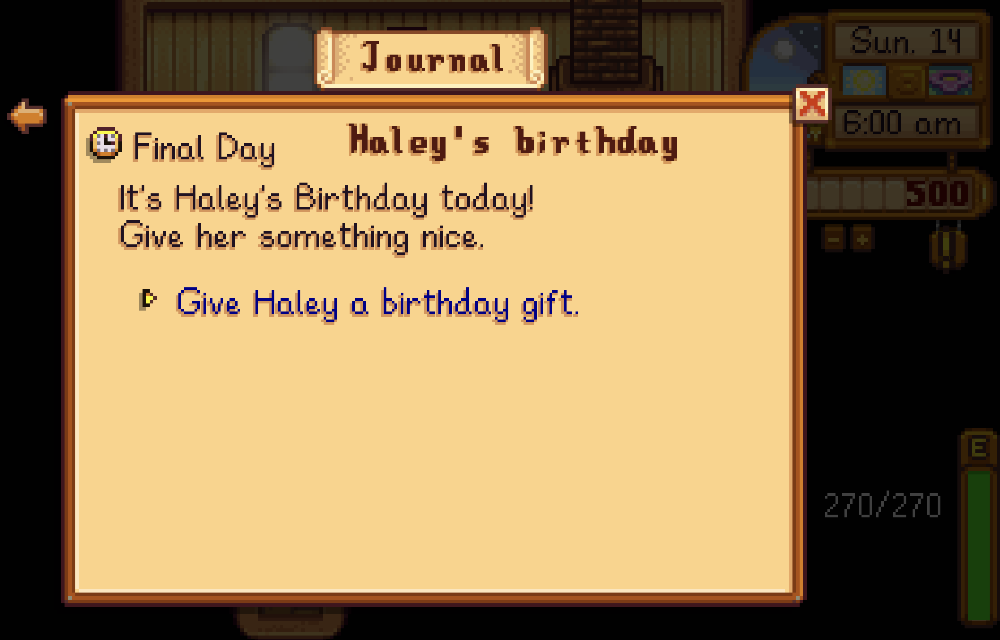
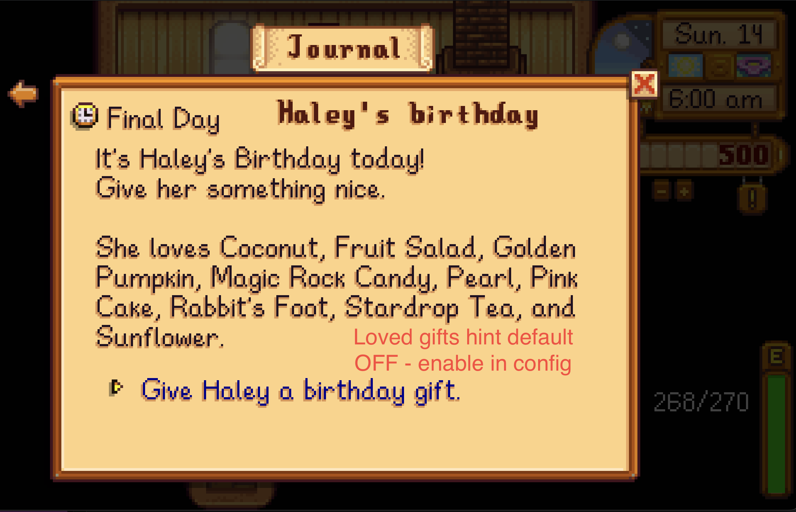
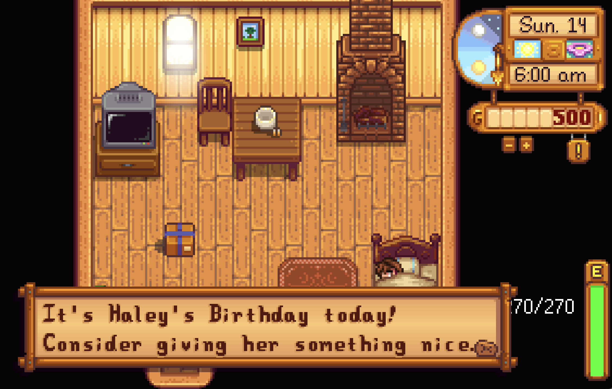

# Stardew Valley Birthday Quest Mod

A mod for Stardew Valley that reminds you when it's someone's birthday and adds 1-day "birthday gift" task to you quest board.

Perfect for people who always forget to give birthday presents!







e.g. on Spring 14 (Haley's birthday)...
1. when you wake up, the game shows a dialogue box reminding you it's Haley's birthday
2. adds a "birthday gift for Haley" limited time quest to your active quest log
3. (optional by config) shows Haley's loved gifts within the quest


## Downloads
Download it here: https://www.nexusmods.com/stardewvalley/mods/46184 or go to releases for the zip.

## How can I enable loved gifts hint?

You can enable it in the config. Config is located in BirthdayQuest/config.json.
Change the third line to:
```
  "LovedGiftsHint": true
```

Available Config options:

- `BirthdayNotification`: shows a wake-up message when today is an NPC's birthday. Default: `true`.
- `BirthdayQuest`: adds a one-day birthday gift quest to your quest log. Default: `true`.
- `LovedGiftsHint`: adds a list of loved gifts to the birthday quest text. Default: `false`.


### TODOs
[x] add recommended gift (by taste) to dialoge/ quest - added toggle on from config.json
    [] add support for Generic Mod Config Menu (GMCM)
[x] fix pronouns
- add npc schedule to quest
- add cross mod compatibility
- add translation compatibility
